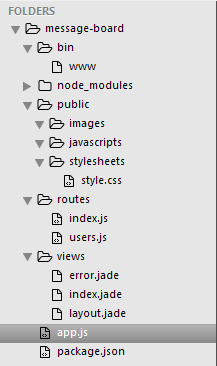

# Express学习

> 最近需要学习node.js,而现在node.js用的最广的就是写后台了。Express是后台框架最火的一个，而本次我用Express的目的是为了搭建一个留言板。

## 安装并生成应用骨架
http://www.expressjs.com.cn/starter/installing.html
官网上写的很清楚，应用骨架就是搭建一个Express开发的模板，使用应用骨架生成的模板目录如下：

## 更换模板引擎
	模板引擎（这里特指用于Web开发的模板引擎）是为了使用户界面与业务数据（内容）分离而产生的，它可以生成特定格式的文档，用于网站的模板引擎就会生成一个标准的HTML文档。
Express默认使用jade模板引擎，对前端程序猿来说并不友好,这意味着我们需要按照jade的编程方式写前端界面。
对于前端来说，使用HTML是自己最熟悉的，而jade模板引擎并不能通过路由打开HTML文件。

	但是可以通过静态资源打开HTML文件，比如把HTML扔在public文件夹内。
	应用骨架中有一句 app.use(express.static(path.join(__dirname, 'public'))); 可以帮助服务器在public文件夹找到HTML。
	然后通过 url/文件名.html 打开该HTML文件。
显然这种打开HTML文件的方式不优雅（也不好用）。我需要通过路由打开HTML文件，所以我需要更换模板引擎。

通过查找资料，我知道了ejs和swig这两个比较有名的模板引擎可以在路由中使用HTML。所以我决定用ejs替换jade。

#### 第一步：下载ejs
npm install ejs --save

#### 第二步：修改模板引擎
模板引擎的配置位于app.js中：

把这段代码改为配置ejs模板引擎：

	  app.set('views',path.join(__dirname , 'views') );
	  app.engine('.html', require('ejs').__express);  
	  app.set('view engine', 'html');

#### 第三步：测试
先在views文件夹创建一个可以正常使用的HTML文件test.html；
然后修改routes文件夹中的index.js中的路由：

最后启动服务器，发现主页确实变成了test.html中的内容！

## 连接数据库
> 配置mongodb参考另一篇文章《安装MongoDB》。

这段代码是用来连接数据库的：

	var mongodb = require("mongodb");
	var Db = mongodb.Db;
	var Server = require('mongodb').Server;
	const url = 'mongodb://localhost:27017/';
	var db = new Db('messageBoard', new Server('localhost', 27017));
	
	function connect(){
	    return new Promise(function(resolve,reject){
	        db.open().then(function( db) {
	            resolve(db)
	            // Get an additional db
	            console.log("open MongoDB");
	        }).catch(function(err){
	            reject(err);
	        });
	    })
	}
	
	exports.connect = connect;

在Express框架根目录中新建一个model文件夹，里面放这个代码的js文件，然后在app.js中引入connect：

	var db = require("./model/connect.js");
	
	db.connect().then(function(db){
	     global.db = db;
	}).catch(function(err){
	    console.log(err);
	});

之后用到数据库的时候用`let myDB = db.collection("message");`即可连接数据库。

## GET和POST请求
> 使用前后端分离的时候，node的主要作用就是提供get和post接口。

### GET接口：

	router.get('/test', function(req, res) {
	  let myDB = db.collection("message");	//新建一个数据库的message表连接
	  let name = req.query.name;	//获取ajax里面的data数据，其中req.query是data全部数据
	  myDB.find({'name':name}).toArray()	//在message表中查询key值为'name'，值为name的数据
	    .then(function(result) {
	      res.send(result);		//查找到之后返回给ajax
	    })
	    .catch(function(err){
	      throw err;
	    });
	});

### POST接口：

	router.post("/message",function(req,res){
	    var message = req.body;
	    console.log(req.body);
	    var messageColletion =  db.collection("message");
	    messageColletion.insertOne({	//数据库插入数据
	        name:message.name,
	        age:message.age,
	        text:message.text
	    })
	        .then(function(){
	            res.json({		//返回json数据
	                status: 0,
	                message: "提交成功"
	            })
	        })
	        .catch(function(err){
	            throw err;
	        })
	})

**需要注意的是在get请求中，ajax的data数据用req.query获取，而post请求中用req.body获取。**