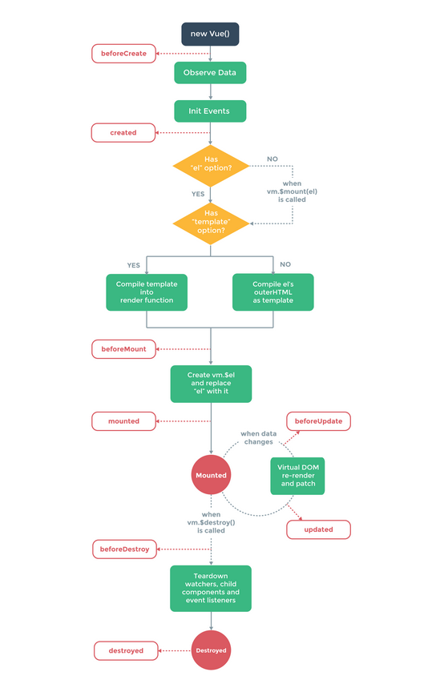
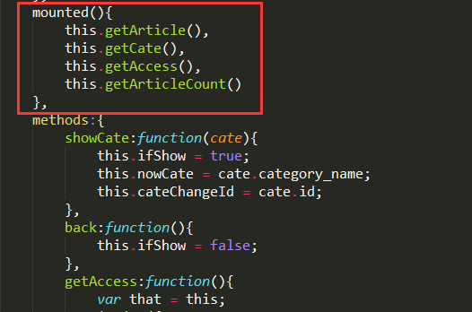

# Vue生命周期简介

> 我在Vue的使用过程中遇到的许多困难，大部分都是因为对Vue的生命周期(工作流程)不够理解。官网上给的生命周期的内容较少，所以使用一段时间Vue并结合其他参考资料的情况下，作出我对Vue生命周期的理解。

## 生命周期图示

一般很难通过这个图示看明白生命周期内容，不过还是要先给出：

## 生命周期介绍
图示中生命周期包括8个钩子：
- beforeCreate
- created
- beforeMount
- mounted
- beforeUpdate
- updated
- beforeDestroy
- destroyed

这些生命周期钩子可以想象成触发的函数。比如在打开网站时，就会至少自动依次触发beforeCreate、created、beforeMount、mounted四个钩子。如果网站内容有更新，那么会自动触发beforeUpdate和updated钩子。如果使用$destroy()，则会触发beforeDestroy和destroyed钩子。

### 什么是钩子？
我把生命周期钩子理解为内部有一串代码的集合。
比如最常用的mounted钩子，其内部一般是一连串的函数调用：

mounted里面调用的是methods这个函数集合里面的指定的函数。
** methods里面写了很多函数，但它们不是自动运行的，需要生命周期钩子调用这些函数。 **
这个时候生命周期钩子的作用就体现出来了：** 什么时候去调用特定的函数。 **

### 生命周期流程及钩子函数介绍
推荐一篇对我很有帮助的文章： —<a href="https://segmentfault.com/a/1190000008010666" target="_blank"> [ 生命周期和钩子函数的一些理解 ] 
该文章中通过HTML代码和浏览器控制台一步步展现了生命周期的过程，并介绍了钩子函数在什么时候被调用，可以用来做什么事情。

##总结：
生命周期简单来说，无非就是什么时候触发对应的钩子，钩子里面调用一些函数，或者自己写一些必要的代码。

